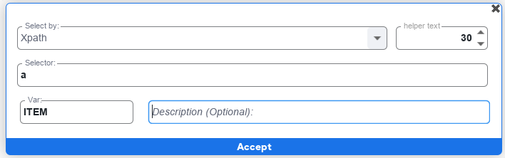
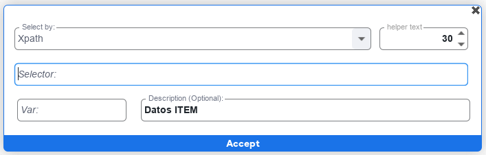

Count Elements es una funcionalidad que posee <a href="http://localhost:8000/codeblock/1-index" target="_self"> selectores </a> y es utilizada para contar los elementos de esos <a href="http://localhost:8000/codeblock/1-index" target="_self"> selectores </a>

#### Campo VAR (Variable)

En este campo se ingresa una variable donde será almacenada la información obtenida de Count Elements

#### Campo Description

En este campo se ingresa una descripción para identificar con mayor facilidad la función que se realiza.

