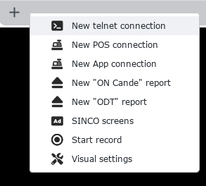
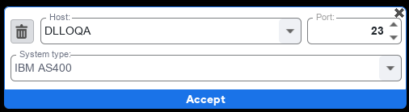
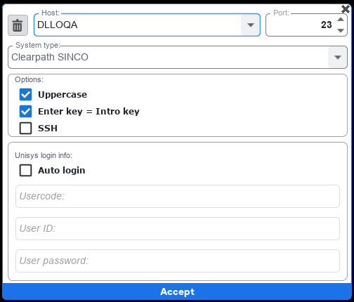
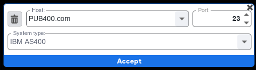
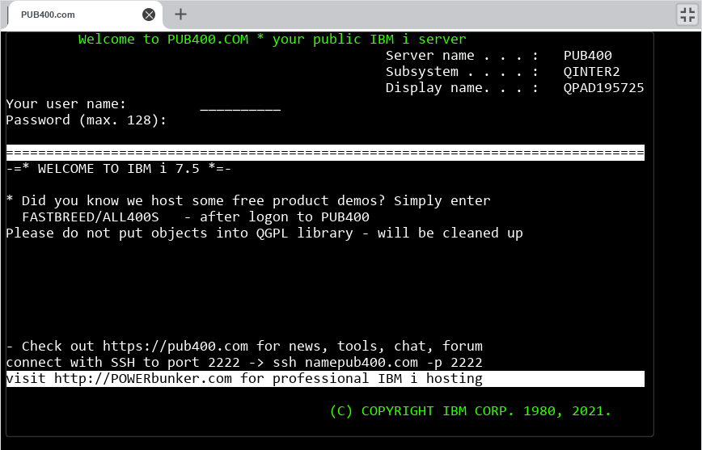

La tecnologia TELNET es la tecnologia que viene desde los años 60 y consiste en programas como cobol 

S-BOT es capaz de automatizar en 

#### Botón SWITCH 

Al abrir S-BOT en la parte superior derecha se tiene un botón switch donde al seleccionar se abre una ventana donde se encuentra una terminal para ejecutar funcionalidades basadas en AS400 y otras tecnologías

#### Panel de funciones

Este panel de funciones aparece al dar segundo clic en la barra superior gris y tendremos funciones como:

- New TELNET connection
- New POS connection
- New APP connection
- New On "cande" report
- New ODT report
- SINCO screens
- Start record
- Visual settings

En este caso nos enfocaremos en la función TELNET

#### Función TELNET Connection

Al seleccionar la función _new telnet connection_ nos encontramos con campos como "HOST", "PORT" y "System type".

- HOST: Se puede escribir dentro cual será la dirección donde se ingresara, estas quedan guardadas para futuros usos.
- PORT: Se puede elegir o tipear el puerto al que será conectada la nueva conexión TELNET
- System Type: Se muestra una lista desplegable según la configuración del HOST
- Botón eliminar: Elimina el host seleccionado

Al seleccionar DLLOQA en HOST y seleccionar Clearpath SINCO se habilitan opciones como:

- Uppercase: Permite que al escribir todas sus letras sean en mayúscula
- Enter key = intro key: Permite que al pulsar la tecla "ENTER" su acción funcione en S-BOT
- SSH: Secure SHell es un protocolo de red usado principalmente para la conexión con máquinas por la línea de comandos. 
- Auto login: Permite guardar los datos de ingreso para no volver a ingresarlos como: Usercode, user ID y user password

### ACCESO A AS400

Para ingresar a AS400 desde TELNET se debe ingresar en el campo _**"HOST"**_ la siguiente información: _**"PUB400.COM"**_ en el campo _**"PORT"**_ se ingresa _**"23"**_, en el campo _**"System type"**_ se selecciona la opción _**"IBM AS400"**_ de la siguiente forma:

Al aceptar la información ingresada de AS400 se muestra la siguiente pantalla: 

