Los selectores son elementos fundamentales en la mayoría de las funciones de S-BOT destinadas a la automatización web. Su importancia radica en la capacidad de ser reutilizados en diversas instancias, adaptándose a los requisitos específicos de cada automatización realizada por el usuario. Dado que desempeñan un papel central en estas funciones, permiten una mayor flexibilidad y eficiencia en la creación y ejecución de pruebas, facilitando la adaptación a los distintos escenarios de prueba que puedan enfrentar.

## Selector XPATH

Este selector desempeña un papel clave al posibilitar la utilización del valor de referencia **XPATH**. Esta funcionalidad resulta esencial para llevar a cabo acciones automatizadas de manera eficiente en S-BOT. Al permitir la identificación precisa de elementos a través de la expresión **XPATH**, los usuarios pueden realizar selecciones específicas en una página web, facilitando así la creación de automatizaciones más precisas y adaptadas a los requisitos particulares de cada escenario de prueba. Este enfoque amplía significativamente las capacidades de S-BOT al proporcionar una mayor flexibilidad y control sobre la interacción automatizada con elementos específicos de una página web.

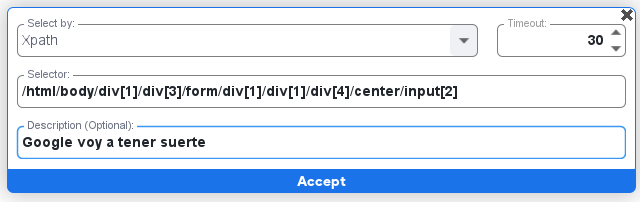

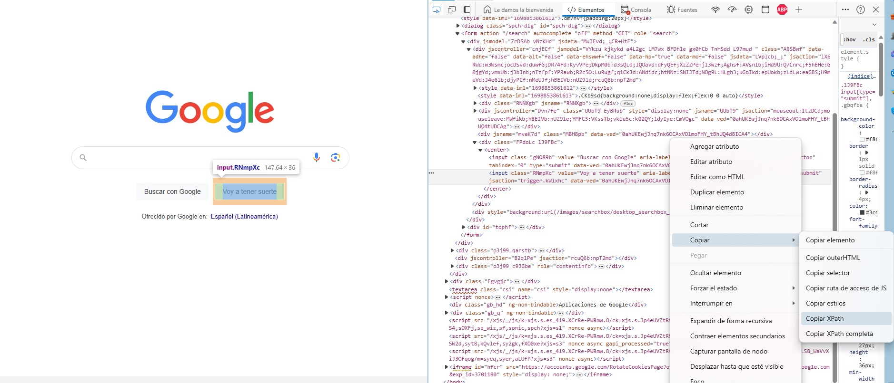

#### Selector ID

Este selector permite usar el valor de **ID** en el inspector de elementos de una página y así poder tener una acción como el click automatizada en S-BOT

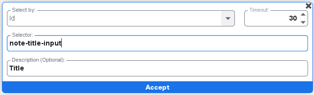

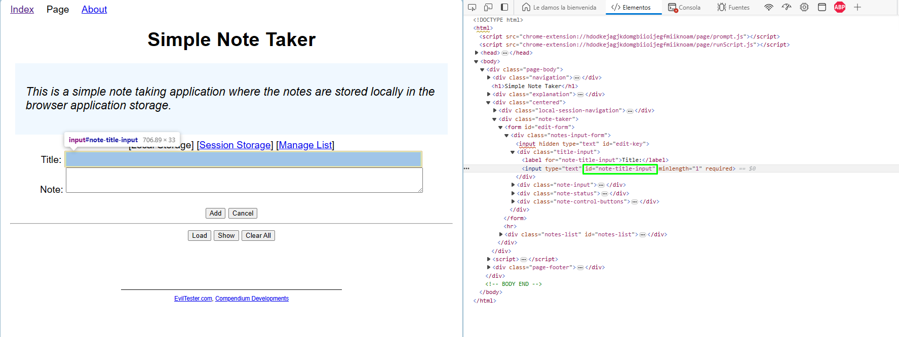

#### Selector ClassName
Este selector permite usar el valor de la clase de un elemento **class** en el inspector de elementos de una página y así poder tener una acción como el click automatizada en S-BOT

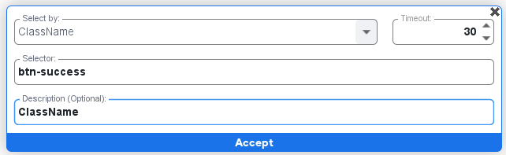

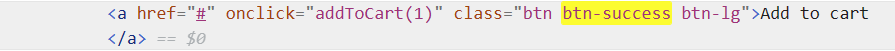

#### Selector CssSelector
Este selector permite usar el valor de la clase de un elemento **CssSelector** en el iunspector de elementos de una página y así tener una acción como el click automatizada en S-BOT

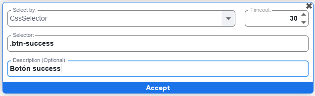

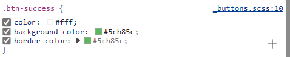

#### Selector LinkText

Este selector permite usar el valor dentro de una etiqueta <a\> que se encuentra en el selector de elementos y dentro tiene un valor como por ejemplo "Wikipedia":

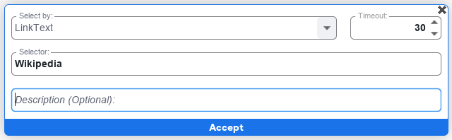

     <a class="ruhjFe NJLBac fl" href="https://es.wikipedia.org/wiki/Q" data-jsarwt="1" data-usg="AOvVaw3zvIbNWEf-F5XBtrilbZ1l" data-ved="2ahUKEwjO_e-WqKaCAxUnk2oFHRbcAoEQmhN6BAgVEAI"> Wikipedia </a>

#### Selector Name
Este selector permite usar el valor de un selector **name** en el inspector de elementos de una página y así poder tener una acción automatizada en S-BOT

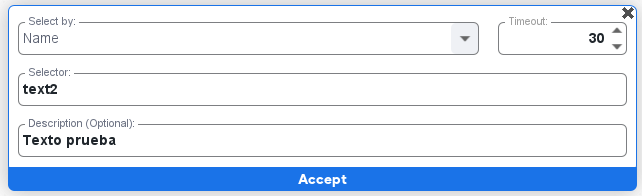

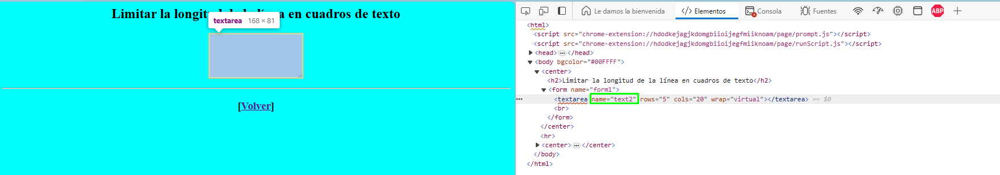

#### Selector TagName

Este selector permite usar cualquier etiqueta de forma general en el inspector de elementos, por ejemplo <div\> y será obtenido el valor de la primera etiqueta que encuentre en el explorador

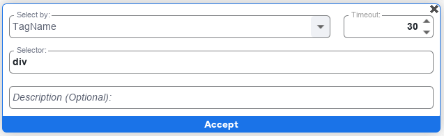

Y este hará click en la primera etiqueta <div\> que encuentre en el explorador, no es recomendable su uso si se requiere una sola etiqueta en especifico

#### Función TimeOut

Esta función permite configurar el tiempo de espera para encontrar el selector seleccionado en la automatización web, de no encontrarla en el tiempo indicado se mostraá en la pantalla de ejecución un error

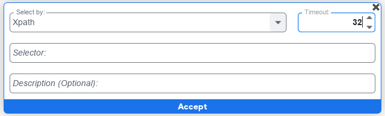

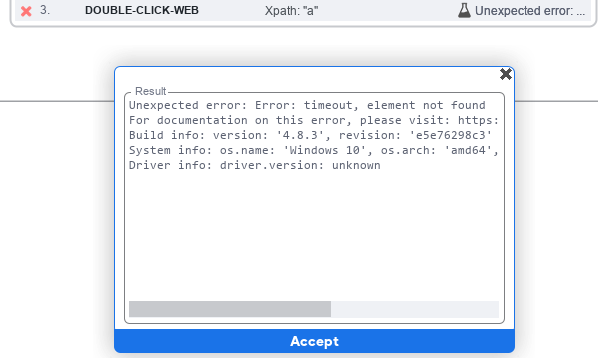