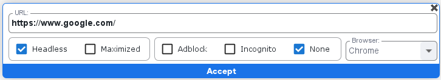
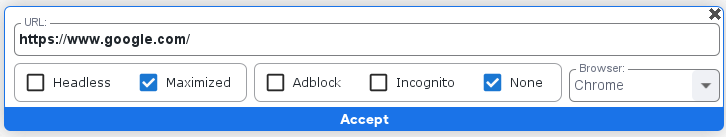
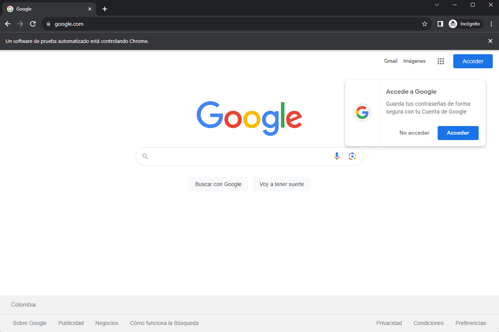

## Función Headless

La opción **headless** permite ejecutar la automatización web sin mostrar la interfaz gráfica del navegador. En otras palabras, la navegación se realiza en segundo plano, sin abrir una ventana visible. Esto es especialmente útil en tareas de automatización donde la interacción visual no es necesaria, lo que puede mejorar la eficiencia y reducir el consumo de recursos. Aunque el usuario no ve la ejecución, los procesos pueden ser monitoreados en el administrador de tareas u otros registros, proporcionando una forma discreta y eficaz de realizar operaciones automatizadas en la web.

## Función Maximized 
La opción **maximized** se refiere a la capacidad de abrir la ventana del navegador con tamaño máximo, ocupando toda la pantalla disponible. La ventana del navegador se expandirá para aprovechar al máximo el espacio de visualización, proporcionando una experiencia de navegación a pantalla completa. Esta característica es útil para aquellos usuarios que desean optimizar su espacio de trabajo y tener una vista más amplia de los contenidos web, eliminando la necesidad de ajustar manualmente el tamaño de la ventana cada vez que abren el navegador.

## Función AdBlock

La opción **Adblock** bloquea la visualización de anuncios publicitarios durante la navegación web. Esta característica permite a los usuarios disfrutar de una experiencia de navegación más limpia y libre de distracciones al evitar los anuncios intrusivos en las páginas visitadas. Adblock utiliza listas predefinidas o personalizables de anuncios conocidos para impedir su aparición, proporcionando así mayor control sobre el contenido que se muestra durante la navegación. Además de mejorar la estética de la experiencia en línea, Adblock también puede contribuir a una carga más rápida de las páginas al reducir la cantidad de datos que se descargan al cargar anuncios.

## Función Incognito

La opción **incognito** proporciona un modo de navegación privada donde se pueden abrir ventanas sin que el historial de navegación, cookies o datos de sesión se almacenen localmente. En este modo, las actividades de navegación no quedan registradas en el historial, y al cerrar la ventana incógnito, se eliminan automáticamente los datos asociados a esa sesión. Esto resulta útil cuando se desea explorar la web de manera temporal sin dejar rastro en el historial de navegación ni afectar la información almacenada en el navegador, proporcionando un nivel adicional de privacidad y confidencialidad durante la sesión de navegación.

## Lista Browser

La lista de **Navegadores** te permite abrir seleccionar los multiples navegadores instalados y soportados por la herramienta SBOT.

